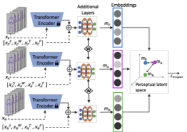

# motion-similarity
A Python project for learning a perceptually-accurate motion space for motion synthesis. This project defines a perceptual motion similarity metric and currently employs both a simple convolutional neural network, as well as an adaption of the triplet similarity network, to the end of capturing user study perception-based similarity differences within an embedding space.  

Final proposed network architecture is as follows: 

[](./images/final_architecture.png)

See the original motivating paper [here](https://drive.google.com/file/d/1x_s68q_QcSxHmW7XdQGjGIGRS34B5cop/view).

All sample videos, regarding the stylized motion comparisons enacted in the aforementioned paper, found [here](https://www.cs.umb.edu/~fundad/drives/); each sample, with the exception of the neutral-neutral sample, compares the neutral action animation (left) to the same action animation stylized by one of the 32 drives (right); read on to learn about Drives.

All motion data is stored as .bvh files; read about the .bvh format [here](https://research.cs.wisc.edu/graphics/Courses/cs-838-1999/Jeff/BVH.html)

## On LMA
Laban Movement Analysis is a technique created by Rudolf Laban to formally describe human movement. It is used in a broad range of fields such as dance, physical therapy, drama, psychology, and anthropology. LMA comprises four categories: Body, Effort, Shape, and Space. LMA terms are capitalized.  

LMA practitioners and educators who studied at [LIMS](https://en.wikipedia.org/wiki/Laban/Bartenieff_Institute_of_Movement_Studies), an accredited institutional member of the [National Association of Schools of Dance](https://en.wikipedia.org/wiki/National_Association_of_Schools_of_Dance) (NASD), are known as "Certified Movement Analysts" (CMAs). Other courses offer LMA studies, including Integrated Movement Studies, which qualifies "Certified Laban/Bartenieff Movement Analysts" (CLMAs). We worked with a CMA and CLMA in the PERFORM project– they are the coauthors Susan Deutsch and Michael Neff. 

**Body** defines the structural aspects of the human body during motion, i.e., what the body is doing and the relationship of the body parts during motion. 

**Effort** is the dynamic component, which is used to describe the characteristics of movement based on humans’ inner attitudes. 

**Shape** determines the way these attitudes are expressed through the body, and it is manifested in postures. 

**Space** describes how a person connects to their environment; locale, directions, and paths of a movement, and it is partly related to steering. 

PERFORM keeps Body and Space fixed and focuses on Shape and Effort components. In fact, it considers Shape regarding its relationship to Effort. So, it wouldn’t be wrong to conclude that we are only focusing on Effort as the dynamic component of LMA in our work.

### On Effort
Effort is described through four motion factors, where each factor is a continuum between bipolar Effort elements: indulging and condensing. The Effort elements are Space (Indirect vs. Direct), Weight (Light vs. Strong), Time (Sustained vs. Sudden), and Flow (Bound vs. Free).
Although each factor is considered continuous in real life, we only focused on the extremes for the sake of simplicity.

Each effort element is characterized by certain trait-descriptive adjectives as:

Indirect: Flexible, meandering, multi-focus
Direct: Single-focus, channeled, undeviating 
Light: Buoyant, delicate 
Strong: Powerful, having an impact 
Sustained: Lingering, leisurely, indulging in time 
Sudden: Hurried, urgent 
Free: Uncontrolled, abandoned, unlimited 
Bound: Careful, controlled, restrained Human beings exhibit a variety of Effort combinations. 

The Efforts are on a continuum between two ends:  
Indirect (-)<--> Direct (+)   
Light (-) <--> Strong (+)  
Sustained (-) <--> Sudden (+)  
Free (-) <--> Bound (+)  

Single Effort elements and combinations of all four Efforts are highly unlikely, and they appear only in extreme cases. In our daily lives, we tend to use Effort in combinations of 2 (States) or 3 (Drives). States are more ordinary and common in everyday usage, whereas Drives are reserved for extraordinary moments in life. We have more intense feelings in these distinctive moments, therefore, they convey more information about our personality.

[Here](https://www.youtube.com/watch?v=OK-7QhORB9k&ab_channel=TehyaMalone) is a good video demonstrating each Effort and several Effort combinations.

### Conda Environment
To install dependencies, cd into the root directory of motion-similarity and create a conda environment from the provided yaml file:
```
$ conda env create -f motion_similarity_env.yml
```
The first line of the yml file sets the new environment's name.
Activate your conda environment by name:
```
$ conda activate motion-similarity
```

### Execute
run the project from the root directory with `python main.py`.


